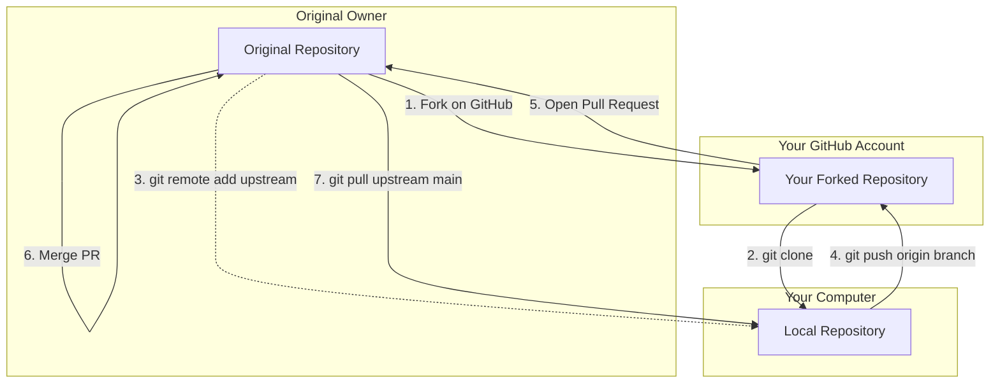

# Fork

## What is it?
A Fork is a GitHub feature (not a Git command) that creates a complete copy of someone else's repository into your own GitHub account.

## Why do we use it?
If you want to contribute to an open-source project, you don't have permission to push code directly to their repository. Instead, you fork their repo to your account, make changes to your copy, and then ask them to pull your changes in.

## Basic Syntax
There is no command-line syntax for forking. It is done on the GitHub website.

## Example
1. Go to an open-source repository on GitHub (e.g., React or Vue).
2. Click the **Fork** button in the top right corner.
3. This creates a copy at `https://github.com/YOUR_USERNAME/project-name`.
4. Clone *your* fork to your computer:
   ```bash
   git clone https://github.com/YOUR_USERNAME/project-name.git
   ```

## Common Mistakes
- **Cloning the original instead of the fork:** If you clone the original repository, you will get a "Permission denied" error when you try to `git push`. Always clone the URL of your own fork.

## Quick Summary
- A fork is a personal copy of someone else's GitHub project.
- Used heavily in open-source contributions.
- Click the Fork button on GitHub, then clone your copy.

## Diagram


